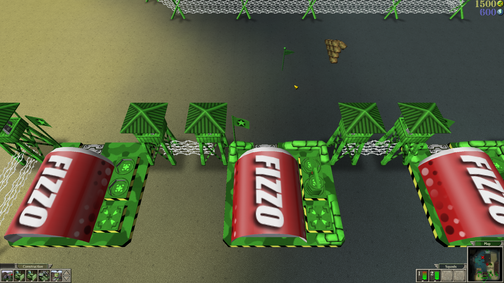
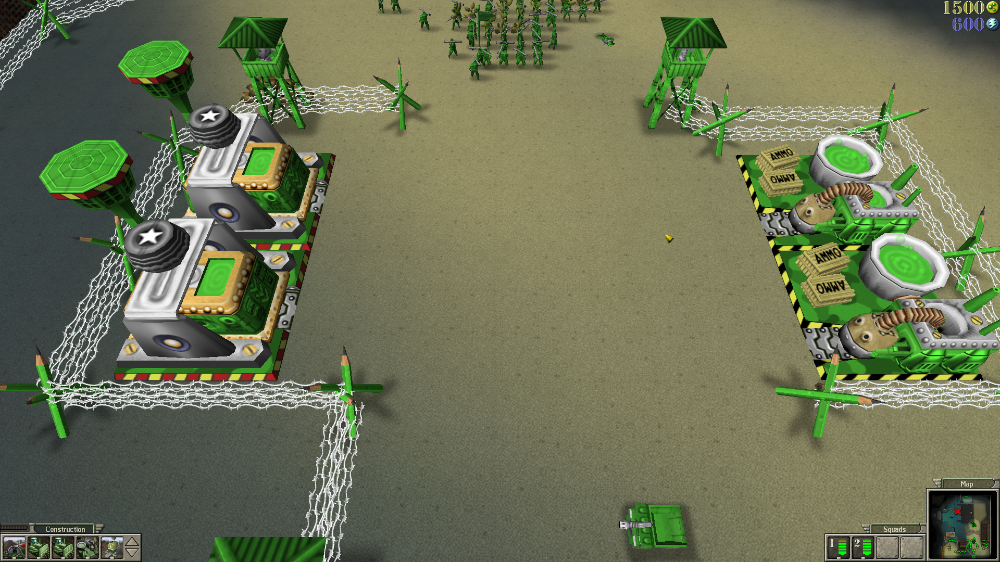
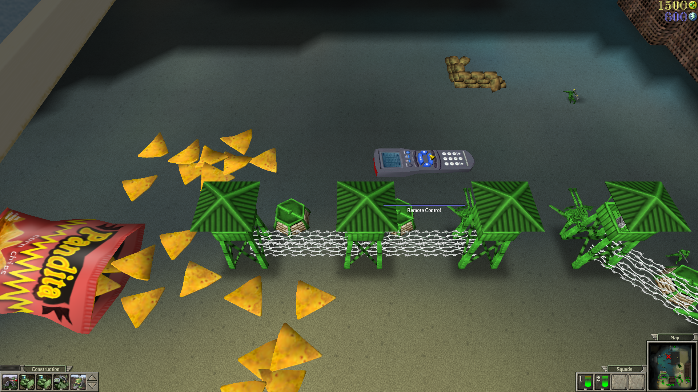
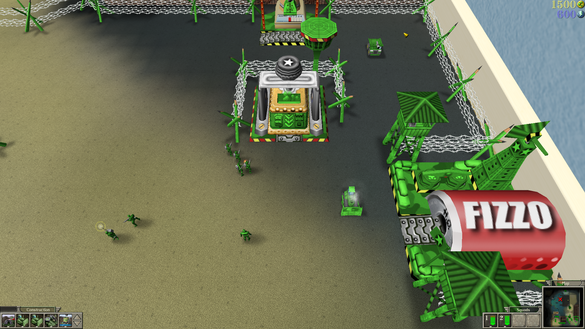
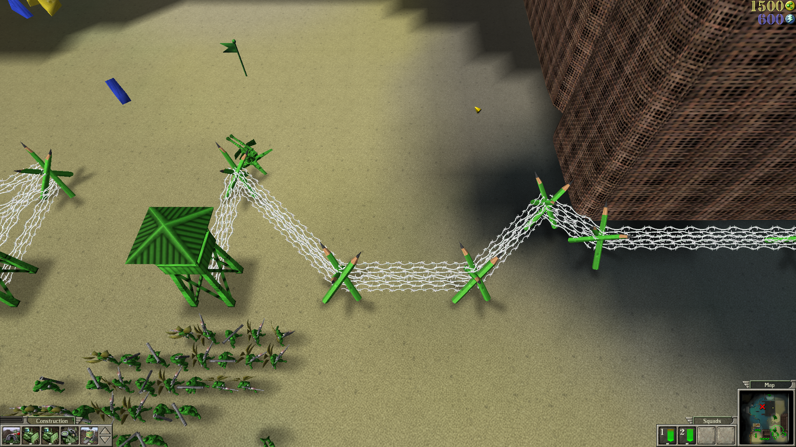

<h1 align="center">Army Men RTS – Improved Building Placement</h1>

<p align="center">
  A focused quality-of-life patch for compact base building in the GOG release of <em>Army Men RTS</em>.
</p>

<p align="center">
  <a href="https://github.com/Flowtacon/army-men-rts-improved-building-placement/releases/latest"></a>
  
  
  <a href="LICENSE"></a>
</p>

<p align="center">
  
</p>

The patch removes the artificial spacing-only restriction around buildings, walls, and blocked map edges. Real footprint overlap remains blocked by the original game logic.

## What changes

| Placement case | Result |
| --- | :---: |
| Normal open terrain | Allowed |
| Directly beside another building | Allowed |
| Close to walls and map boundaries | Allowed |
| Actual building footprint overlap | Still blocked |

## Screenshots

<table>
  <tr>
    <td width="50%" align="center">
      <br>
      <sub><strong>Compact base layouts</strong><br>More usable space inside defensive lines.</sub>
    </td>
    <td width="50%" align="center">
      <br>
      <sub><strong>Tight building rows</strong><br>Structures can be placed directly beside each other.</sub>
    </td>
  </tr>
  <tr>
    <td width="50%" align="center">
      <br>
      <sub><strong>Dense defensive lines</strong><br>Towers and wire no longer require artificial gaps.</sub>
    </td>
    <td width="50%" align="center">
      <br>
      <sub><strong>Boundary placement</strong><br>Build closer to map geometry and blocked edges.</sub>
    </td>
  </tr>
  <tr>
    <td colspan="2" align="center">
      <br>
      <sub><strong>Flexible perimeter construction</strong><br>Use narrow and irregular spaces more effectively.</sub>
    </td>
  </tr>
</table>

## Quick installation

1. Download the [latest release ZIP](https://github.com/Flowtacon/army-men-rts-improved-building-placement/releases/latest).
2. Extract all files into the directory containing `amrts.exe`.
3. Double-click **`Install Mod.cmd`**.
4. Read the result and press any key to close the window.

> [!IMPORTANT]
> Close the game before installing or uninstalling. If writing to the game directory is denied, right-click `Install Mod.cmd` and select **Run as administrator**.

## Safety and compatibility

- Supported release: **GOG**
- Original `amrts.exe` SHA-256: `34C9CACFCD42A816A5A9E886FBE18AE69CA2B82BDB7ED95588772F3079777B59`
- Patched `amrts.exe` SHA-256: `CB88A1F148BC9717F3B11B1310103F62E08CB3C3FA70D3DE76BB5A9C24D92F95`
- Unknown executable versions are rejected without modification.
- `amrts.exe.backup` is created and verified before replacement.
- The patched temporary copy is verified before it becomes the active executable.
- No game executable or other game files are distributed by this project.

The CMD launcher applies the PowerShell execution-policy bypass only to its own process. It does not change the execution policy saved on the computer.

## Uninstallation

Double-click **`Uninstall Mod.cmd`** in the game directory. The uninstaller verifies both the backup and the current patched executable before restoring the clean file. The verified backup is retained after restoration.

<details>
<summary><strong>Manual PowerShell commands</strong></summary>

Install:

```powershell
powershell.exe -NoProfile -ExecutionPolicy Bypass -File .\install.ps1
```

Uninstall:

```powershell
powershell.exe -NoProfile -ExecutionPolicy Bypass -File .\uninstall.ps1
```

Explicit executable path:

```powershell
.\install.ps1 -ExecutablePath "E:\GOG Galaxy\Games\Army Men RTS\amrts.exe"
```

</details>

<details>
<summary><strong>Technical patch details</strong></summary>

The supported executable uses image base `0x00400000`. At VA `0x00584EC7` (file offset `0x00184EC7`), the patch replaces:

```text
F7 DB 1B DB 83 C3 06
```

with:

```text
8D 1C 9D 01 00 00 00
```

The original result logic maps `onFoot = 0` to the spacing-only rejection and `onFoot = 1` to actual footprint overlap. The replacement maps the spacing-only case to `PR_OK` while preserving the overlap result.

</details>

## Scope and license

The release does not include or modify `base.x` or `winmm.dll`. It only patches the exact supported `amrts.exe`. This project is not affiliated with or endorsed by the game's publishers or distributors. Use it with a legally obtained copy of the game.

The patching scripts and documentation are licensed under the [MIT License](LICENSE). The game and its files are not covered by this license.
